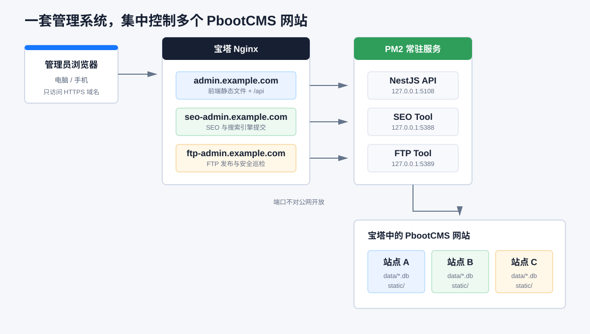
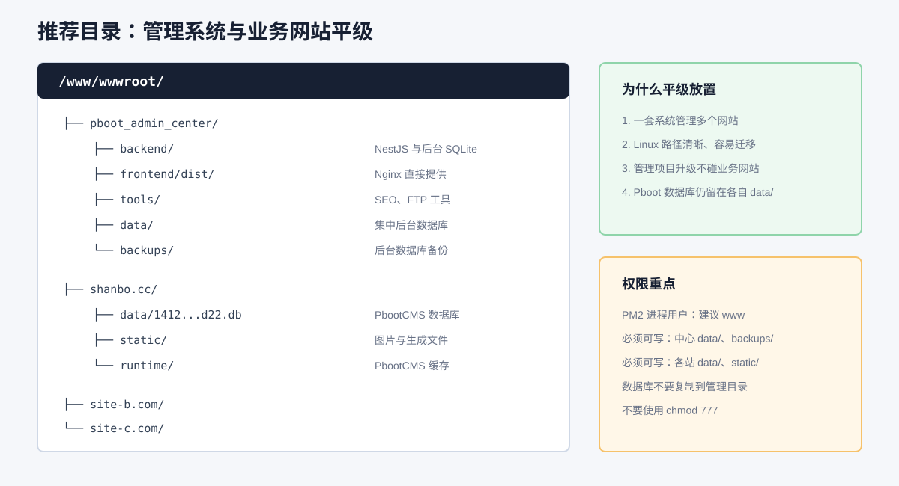
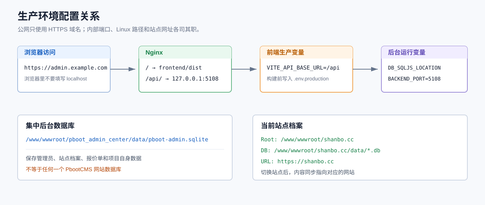
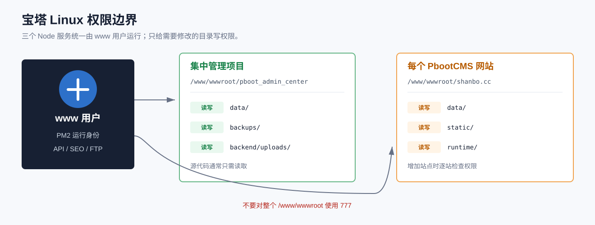
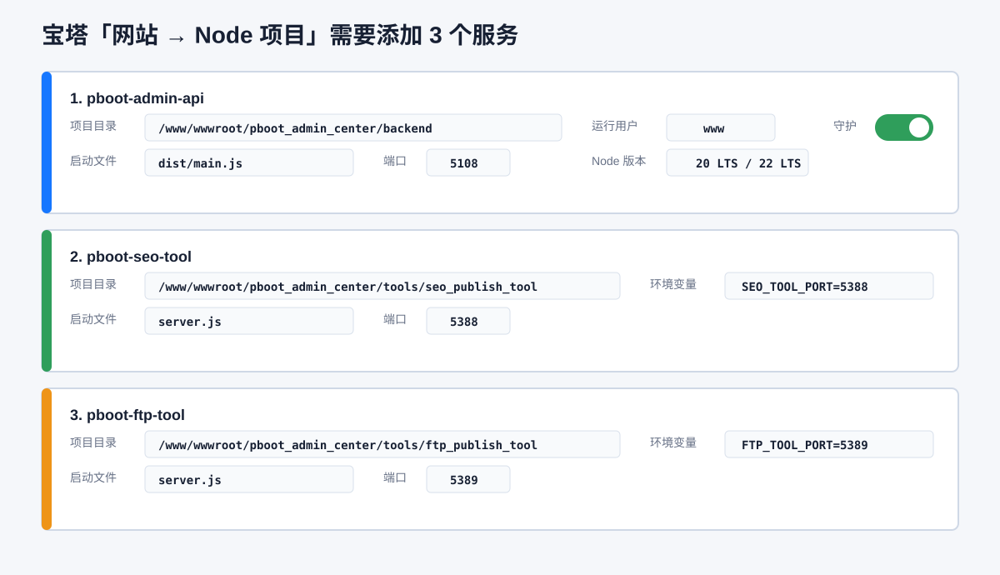
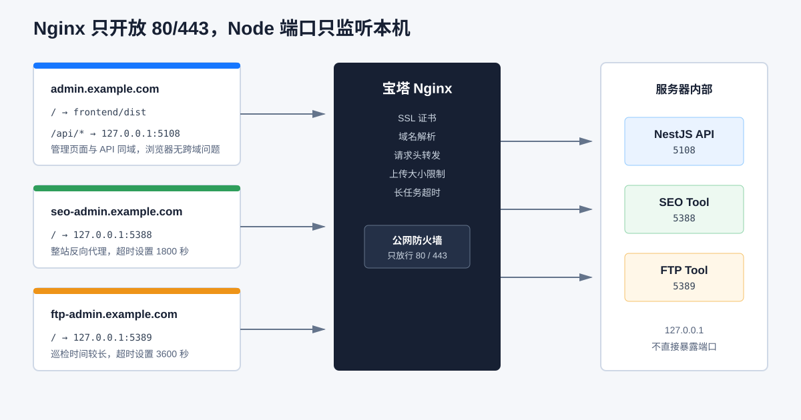
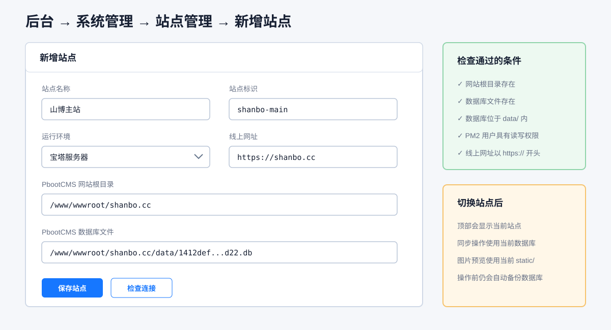
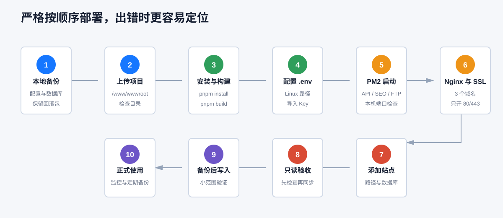
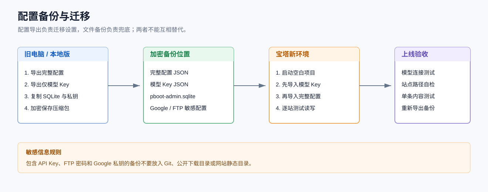

# Pboot Admin 宝塔集中部署图文教程

> 适用项目：`pboot_admin_center`  
> 本地开发目录：`E:\phpstudy_pro\WWW\pboot_admin_center`  
> 宝塔目标目录：`/www/wwwroot/pboot_admin_center`  
> 文档更新：2026-09-11

## 本次全新安装入口

使用宝塔已有的 **PM2 管理器**：先在“Node版本”安装 Node.js 22 LTS（至少 22.12.0），再把仓库克隆到下面的独立目录。`bash deploy/prepare-baota.sh` 只生成全新配置、安装依赖并构建，不另装 Node/PM2 守护、不创建 systemd 服务、不修改 Nginx 或业务网站。已有数据库时停止，不能用它覆盖旧部署。

- 项目：`/www/wwwroot/pboot_admin_center`；运行时使用宝塔 PM2 管理器选定的 Node。
- 新数据库：`data/pboot-admin.sqlite`，不迁移本地账号、内容或密钥。
- 启动配置：`deploy/baota.ecosystem.config.js`，包括 API、SEO 工具、FTP 工具及 SEO worker。必须使用宝塔现有 PM2 的命令、用户和 PM2_HOME，不创建第二套进程列表。
- 启动、停止和日志在宝塔 PM2 管理器中查看；运行用户应与目录及 `.env` 权限匹配。
- API/工具仅监听回环地址。前端构建输出在 `frontend/dist`，域名确定后配置独立 Nginx 站点；不改已有网站的域名或 80/443 配置。
- 域名未配置时，可把 `deploy/nginx/pboot-admin-loopback.conf` 安装到宝塔 Nginx 的独立 vhost 配置，先执行 `nginx -t` 再 reload。仅监听 `127.0.0.1:5278`，可在服务器测试首页及 `/api/project-identity`，不可从公网访问。
- 首次安装只完成内部服务。管理员账号初始化、管理域名、HTTPS、工具域名和模型密钥另行配置；不应直接开放内部端口到公网。
- 正式环境必须设置随机 `JWT_SECRET`，关闭公开注册和默认 Swagger；准备脚本生成独立密钥，不输出到日志，也不覆盖已有 `.env`。新建管理员需在服务器端初始化，或之后由已有管理员添加，不再通过公网注册。
- PDF 导出还需安装服务器 Chromium 及其系统依赖，不能把 Windows 浏览器复制到 Linux。
- SEO 全局默认暂停，无需搜索密钥也能安装启动。部署包应包含 `tools/seo-content-worker/skills/`。

下面是手动部署参考；Node.js 应使用仍受支持的 LTS，项目最低要求 22.12.0。参考 [Node.js 官方版本与下载](https://nodejs.org/en/download)。

本教程的目标是在宝塔服务器上只部署一套 Pboot Admin，通过一个管理后台选择并操作同一台服务器上的多个 PbootCMS 网站。



## 一、先确认部署范围

建议准备三个仅供管理使用的域名：

| 用途 | 示例域名 | 内部服务 |
|---|---|---|
| 管理后台 | `admin.example.com` | 前端静态文件 + `127.0.0.1:5108` |
| SEO 工具 | `seo-admin.example.com` | `127.0.0.1:5388` |
| FTP 与巡检 | `ftp-admin.example.com` | `127.0.0.1:5389` |

请把教程中的 `example.com` 替换为自己的真实管理域名。三个域名都解析到同一台宝塔服务器。

当前版本已经实现：

- 站点档案和顶部站点切换。
- 菜单、新闻、产品、单页、视频同步按所选站点访问 PbootCMS 数据库。
- PbootCMS 数据库路径和 `static` 图片按站点解析。
- 同步前验证数据库必须位于所选网站的 `data` 目录。

当前仍在继续完善：

- 辅助库中的新闻、产品、报价单等数据需要进一步按站点完全隔离。
- SEO、Google、Bing、百度、Yandex、FTP 配置需要进一步与站点档案统一。

因此第一次部署时建议先接入一个正式网站，确认所有读写流程正常后，再批量添加其他网站。

当前管理后台、SEO 工具和 FTP 工具在生产环境使用三个独立域名。构建前在前端生产配置设置 `VITE_API_BASE_URL=/api`、`VITE_SEO_TOOL_URL=https://seo-admin.example.com`、`VITE_FTP_TOOL_URL=https://ftp-admin.example.com`，替换为自己的域名。顶部导航跟随这些地址，不再使用写死的 localhost。修改后需重新构建前端。

## 二、宝塔需要安装什么

推荐环境：

| 组件 | 建议 |
|---|---|
| 宝塔 Linux 面板 | 当前稳定版或正式版 |
| Web 服务 | Nginx |
| Node.js | 22 LTS，至少 22.12.0 |
| Node 项目管理 | 宝塔 Node.js 版本管理器 / PM2 |
| PHP | 按现有 PbootCMS 网站要求安装 |
| 数据库 | 本管理项目使用 SQLite 文件，不需要新建 MySQL |

宝塔官方参考：

- [宝塔官方 Node.js PM2 部署教程](https://docs.bt.cn/practical-tutorials/nodejs-pm2-deployment)
- [宝塔官方反向代理配置指南](https://docs.bt.cn/user-guide/site/php/site-config/reverse-proxy)
- [宝塔面板新手安装指引](https://docs.bt.cn/landing/getting-started/)

在宝塔进入：

1. `软件商店`。
2. 搜索并安装 `Node.js 版本管理器`。
3. 安装 Node.js 22 LTS，至少 22.12.0。
4. 设置该版本为命令行版本。
5. 确认 Nginx 正常运行。

在宝塔终端检查：

```bash
node --version
npm --version
```

## 三、推荐目录结构

管理系统不要塞进某一个 PbootCMS 网站内部。它应与各业务网站平级放置：



```text
/www/wwwroot/
  pboot_admin_center/
  shanbo.cc/
  site-b.com/
  site-c.com/
```

这样升级管理系统不会覆盖业务网站，也不需要每个网站复制一份管理项目。

## 四、在本地准备上传包

上传前先在本地完成：

1. 在项目配置页导出完整配置备份。
2. 额外导出一份“仅模型 Key”备份。
3. 备份 `backend/dev.sqlite`。
4. 备份 Google 服务账号 JSON、SEO 配置和 FTP 配置。
5. 给项目制作 ZIP 包。

ZIP 包不需要包含：

```text
.git/
node_modules/
backend/dist/
frontend/dist/
logs/
tmp/
backups/
```

必须包含源码、锁文件、`.env.example`、配置导出文件和需要迁移的后台 SQLite 数据库。

## 五、上传并解压

在宝塔进入 `文件`，打开：

```text
/www/wwwroot
```

上传 ZIP 并解压，最终必须得到：

```text
/www/wwwroot/pboot_admin_center/backend/package.json
/www/wwwroot/pboot_admin_center/frontend/package.json
/www/wwwroot/pboot_admin_center/tools/seo_publish_tool/server.js
/www/wwwroot/pboot_admin_center/tools/ftp_publish_tool/server.js
```

不要多解压一层。例如下面这种路径是错误的：

```text
/www/wwwroot/pboot_admin_center/pboot_admin_center/backend
```

## 六、安装 pnpm 和项目依赖

在宝塔终端执行：

```bash
cd /www/wwwroot/pboot_admin_center
corepack enable
corepack prepare pnpm@latest --activate
pnpm --version
```

如果系统没有 `corepack`，使用：

```bash
npm install -g pnpm
```

安装四部分依赖：

```bash
cd /www/wwwroot/pboot_admin_center/backend
pnpm install --frozen-lockfile

cd /www/wwwroot/pboot_admin_center/frontend
pnpm install --frozen-lockfile

cd /www/wwwroot/pboot_admin_center/tools/seo_publish_tool
pnpm install --frozen-lockfile

cd /www/wwwroot/pboot_admin_center/tools/ftp_publish_tool
pnpm install --frozen-lockfile
```

不要混用 `npm install` 和 `pnpm install`。

## 七、配置后台数据库和 Linux 路径

先建立集中后台的数据及备份目录：

```bash
mkdir -p /www/wwwroot/pboot_admin_center/data
mkdir -p /www/wwwroot/pboot_admin_center/backups/backend_database
mkdir -p /www/wwwroot/pboot_admin_center/managed-sites
```

如果需要保留本地管理后台中的账号、报价单和内容数据，把本地 `backend/dev.sqlite` 上传后复制为：

```bash
cp /www/wwwroot/pboot_admin_center/backend/dev.sqlite \
   /www/wwwroot/pboot_admin_center/data/pboot-admin.sqlite
```

全新部署、不保留本地管理数据时不要执行上面的 `cp`。只要 `data` 目录可写，后端首次启动会创建空数据库。正式环境不开放匿名注册，管理员需通过服务器端初始化。

复制环境变量模板：

```bash
cp /www/wwwroot/pboot_admin_center/backend/.env.example \
   /www/wwwroot/pboot_admin_center/backend/.env
```

在宝塔文件编辑器打开 `backend/.env`，参考以下内容：

```dotenv
DB_TYPE=sqljs
DB_SQLJS_LOCATION=/www/wwwroot/pboot_admin_center/data/pboot-admin.sqlite

BACKEND_PORT=5108
FRONTEND_PORT=5278
REQUEST_BODY_LIMIT=20mb
SEO_TOOL_PORT=5388
FTP_TOOL_PORT=5389

PBOOT_SITE_ROOT=/www/wwwroot/shanbo.cc
PBOOT_DB_PATH=/www/wwwroot/shanbo.cc/data/请替换成真实数据库文件.db
PBOOT_PUBLIC_BASE_URL=https://shanbo.cc

BACKEND_DB_BACKUP_DIR=/www/wwwroot/pboot_admin_center/backups/backend_database

OPENAI_API_KEY=
ZHIPU_API_KEY=
DEEPSEEK_API_KEY=
DASHSCOPE_API_KEY=

YOUTUBE_API_KEY=
```



注意：

- 不能把 `E:\phpstudy_pro\...` 这种 Windows 路径带到宝塔。
- `PBOOT_DB_PATH` 必须位于所选站点的 `data` 目录。
- 不要把 PbootCMS 数据库复制到管理系统目录，系统应直接操作网站原数据库。
- `YOUTUBE_API_KEY` 是全站共用 Key，也可在“站点管理”中保存；每个网站的频道 ID 在站点编辑页单独填写。
- Key 可以从本地导出的配置备份中恢复，不要写进教程或 Git。

## 八、配置并构建前端

复制项目附带的生产环境模板：

```bash
cp /www/wwwroot/pboot_admin_center/deploy/frontend.env.production.example \
   /www/wwwroot/pboot_admin_center/frontend/.env.production
```

其中最重要的是：

```dotenv
VITE_API_BASE_URL=/api
```

生产环境不能继续使用 `http://localhost:5108`。外部用户浏览器中的 `localhost` 指向用户自己的电脑，不是宝塔服务器。

开始构建：

```bash
cd /www/wwwroot/pboot_admin_center/backend
pnpm run build

cd /www/wwwroot/pboot_admin_center/frontend
pnpm run build
```

构建完成后检查：

```bash
test -f /www/wwwroot/pboot_admin_center/backend/dist/main.js && echo backend-ok
test -f /www/wwwroot/pboot_admin_center/frontend/dist/index.html && echo frontend-ok
```

## 九、设置文件权限

宝塔 Node 项目建议使用 `www` 用户运行。集中数据库、备份目录和各 PbootCMS 网站的 `data/static/runtime` 必须允许同一个用户读写。

```bash
chown -R www:www /www/wwwroot/pboot_admin_center

chown -R www:www /www/wwwroot/shanbo.cc/data
chown -R www:www /www/wwwroot/shanbo.cc/static
chown -R www:www /www/wwwroot/shanbo.cc/runtime
```

确认关键目录：

```bash
ls -ld /www/wwwroot/pboot_admin_center/data
ls -ld /www/wwwroot/pboot_admin_center/backups/backend_database
ls -ld /www/wwwroot/shanbo.cc/data
```



不要使用 `chmod -R 777`。如果出现写入失败，先检查 PM2 实际运行用户和目录所有者。

## 十、在宝塔添加三个 Node 项目

宝塔官方 Node 项目管理默认使用 PM2 守护进程。进入 `网站 → Node 项目 → 添加 Node 项目`。



### 1. 管理后台 API

| 配置项 | 填写内容 |
|---|---|
| 项目名称 | `pboot-admin-api` |
| 项目目录 | `/www/wwwroot/pboot_admin_center/backend` |
| 启动文件 | `dist/main.js` |
| 端口 | `5108` |
| Node 版本 | 20 LTS 或 22 LTS |
| 运行用户 | `www` |

### 2. SEO 工具

| 配置项 | 填写内容 |
|---|---|
| 项目名称 | `pboot-seo-tool` |
| 项目目录 | `/www/wwwroot/pboot_admin_center/tools/seo_publish_tool` |
| 启动文件 | `server.js` |
| 端口 | `5388` |
| 环境变量 | `SEO_TOOL_PORT=5388` |

### 3. FTP 与安全巡检工具

| 配置项 | 填写内容 |
|---|---|
| 项目名称 | `pboot-ftp-tool` |
| 项目目录 | `/www/wwwroot/pboot_admin_center/tools/ftp_publish_tool` |
| 启动文件 | `server.js` |
| 端口 | `5389` |
| 环境变量 | `FTP_TOOL_PORT=5389` |

三个项目都开启：

- 开机启动。
- 异常自动重启。
- 单实例运行。

后台使用 SQL.js 自动保存，`pboot-admin-api` 不要开启 PM2 集群模式，也不要启动多个实例同时写同一个 SQLite 文件。

### 使用项目附带的 PM2 文件

如果更习惯终端，可以直接使用：

```bash
cd /www/wwwroot/pboot_admin_center
pm2 start deploy/ecosystem.config.cjs
pm2 save
pm2 status
```

宝塔界面添加和 `ecosystem.config.cjs` 二选一，不要重复启动同一服务。

## 十一、先检查本机服务

```bash
curl -I http://127.0.0.1:5108/api-docs
curl -I http://127.0.0.1:5388/
curl -I http://127.0.0.1:5389/
```

也可以运行项目附带的检查脚本：

```bash
cd /www/wwwroot/pboot_admin_center
bash deploy/baota-health-check.sh
```

只有三个本机地址都能返回 HTTP 状态码，才继续配置 Nginx。

## 十二、在宝塔添加三个网站和 SSL

在宝塔 `网站` 页面添加：

```text
admin.example.com
seo-admin.example.com
ftp-admin.example.com
```

不需要为这三个管理域名新建 MySQL 数据库。给三个域名分别申请 SSL 证书，并开启强制 HTTPS。



### 管理后台域名

网站根目录设置为：

```text
/www/wwwroot/pboot_admin_center/frontend/dist
```

在网站 Nginx 配置中加入项目模板里的内容：

[管理后台 Nginx 模板](../deploy/nginx/admin.example.com.conf)

关键路由：

```nginx
location / {
    try_files $uri $uri/ /index.html;
}

location ^~ /api/ {
    proxy_pass http://127.0.0.1:5108/;
    proxy_set_header Host $host;
    proxy_set_header X-Real-IP $remote_addr;
    proxy_set_header X-Forwarded-For $proxy_add_x_forwarded_for;
    proxy_set_header X-Forwarded-Proto $scheme;
    proxy_read_timeout 600s;
    client_max_body_size 20m;
    proxy_buffering off;
}
```

`proxy_pass` 末尾的 `/` 不能漏掉，否则 `/api/sites` 可能被错误转发为后端的 `/api/sites`，而后端实际接口是 `/sites`。

### SEO 域名

使用：

[SEO Nginx 模板](../deploy/nginx/seo-admin.example.com.conf)

目标地址：

```text
http://127.0.0.1:5388
```

SEO 批量诊断和 AI 修复可能运行较久，模板将读取超时设置为 1800 秒。

### FTP 域名

使用：

[FTP Nginx 模板](../deploy/nginx/ftp-admin.example.com.conf)

目标地址：

```text
http://127.0.0.1:5389
```

远程巡检可能持续很久，模板将读取超时设置为 3600 秒。

## 十三、防火墙端口

公网只需要开放：

```text
80
443
宝塔面板自身端口
SSH 端口
```

不要向公网开放：

```text
5108
5278
5388
5389
```

这些端口只供本机 Nginx 和 PM2 使用。

管理域名最好再增加至少一种限制：

- 宝塔网站访问限制。
- Nginx Basic Auth。
- 固定办公 IP 白名单。
- Cloudflare Access 等身份验证。

特别注意：当前登录页带有注册入口。第一次创建管理员后，不应让管理域名完全公开给陌生用户。

## 十四、在集中后台添加宝塔网站

登录：

```text
https://admin.example.com
```

进入 `系统管理 → 站点管理 → 新增站点`。



以 `shanbo.cc` 为例：

| 字段 | 内容 |
|---|---|
| 站点名称 | `山博主站` |
| 站点标识 | `shanbo-main` |
| 运行环境 | `宝塔服务器` |
| 网站根目录 | `/www/wwwroot/shanbo.cc` |
| 数据库文件 | `/www/wwwroot/shanbo.cc/data/真实数据库文件.db` |
| 线上网址 | `https://shanbo.cc` |

保存后点击 `检查`。必须看到网站根目录、数据库和 `data` 目录归属检查通过。

同服务器上的其他 PbootCMS 网站使用同样方式添加，不需要配置 FTP。外部服务器上的网站才使用 FTP/SFTP 发布和巡检。

## 十五、第一次上线验收



按以下顺序检查：

1. 打开管理后台并登录。
2. 打开站点管理，确认当前站点路径全部是 Linux 路径。
3. 点击站点 `检查`，不要立即同步。
4. 打开菜单、新闻、产品页面，只读取数据。
5. 检查 PbootCMS 图片能否显示。
6. 手动备份目标网站的 `data/*.db`。
7. 选择一条测试内容执行同步。
8. 打开真实网站检查页面。
9. 确认数据库旁边生成了同步前备份。
10. 再开始批量同步或 AI 修复。

## 十六、配置迁移



推荐流程：

1. 本地进入配置备份页面。
2. 导出完整配置。
3. 再导出“仅模型 Key”。
4. 宝塔版本启动后先导入模型 Key。
5. 再导入完整配置。
6. 检查所有 Windows 路径并改成 Linux 路径。
7. Google 服务账号 JSON 文件重新选择服务器上的真实路径。
8. FTP、SEO、站点配置分别测试后再保存。

不要因为配置导入成功就直接运行批量操作，路径检查必须单独做一次。

## 十七、备份哪些文件

至少备份：

```text
/www/wwwroot/pboot_admin_center/data/
/www/wwwroot/pboot_admin_center/backend/.env
/www/wwwroot/pboot_admin_center/managed-sites/
/www/wwwroot/pboot_admin_center/backups/
```

`managed-sites/<站点标识>/api/uploads/` 是该站的后台上传目录；`seo/`、`ftp/`、`google/`、`state/` 分别保存当前站的配置和断点。不再备份旧版全局 `backend/uploads/` 或 `tools/*/*.json`。

还要继续使用宝塔计划任务备份每个 PbootCMS 网站：

```text
/www/wwwroot/站点域名/data/
/www/wwwroot/站点域名/static/
```

后台数据库和 PbootCMS 数据库是两套不同的数据，必须分别备份。

## 十八、以后更新项目

更新前：

```bash
pm2 status
cp /www/wwwroot/pboot_admin_center/data/pboot-admin.sqlite \
   /www/wwwroot/pboot_admin_center/data/pboot-admin.before-update.sqlite
```

上传新代码后：

```bash
cd /www/wwwroot/pboot_admin_center/backend
pnpm install --frozen-lockfile
pnpm run build

cd /www/wwwroot/pboot_admin_center/frontend
pnpm install --frozen-lockfile
pnpm run build

cd /www/wwwroot/pboot_admin_center/tools/seo_publish_tool
pnpm install --frozen-lockfile

cd /www/wwwroot/pboot_admin_center/tools/ftp_publish_tool
pnpm install --frozen-lockfile

cd /www/wwwroot/pboot_admin_center
pm2 reload deploy/ecosystem.config.cjs
pm2 status
```

不要删除服务器上的 `.env`、后台数据库、SEO 配置、FTP 配置、服务账号文件和上传目录。

## 十九、常见问题

| 现象 | 原因与处理 |
|---|---|
| 管理域名显示 502 | 5108 后端未启动；先用 `curl http://127.0.0.1:5108/project-identity` 检查 |
| 页面打开但接口失败 | 前端仍使用 `localhost:5108`；确认 `.env.production` 是 `VITE_API_BASE_URL=/api` 后重新构建 |
| 切换站点后数据库不存在 | 站点中还保存着 Windows 路径；改成 `/www/wwwroot/...` |
| 同步提示无权限 | PM2 用户不能写 PbootCMS 的 `data/static/runtime` |
| 图片显示 404 | `static` 目录路径错误，或 Nginx 没有把 `/api` 正确代理到 5108 |
| PM2 重启后 SQLite 损坏 | 启动了多个 API 实例；保持单实例并使用优雅重启 |
| SEO 或 AI 修复中途 504 | Nginx 读取超时太短；使用模板中的 600/1800 秒配置 |
| FTP 巡检很慢 | 第一次需要建立基线；后续使用增量巡检和断点继续 |
| Google 返回 403 | 检查服务账号是否加入 Search Console，并确认对应 API 已启用 |
| 外网能直接访问 5388/5389 | 防火墙配置错误；关闭公网端口，只允许 Nginx 反向代理 |

## 二十、最终验收清单

- [ ] 三个管理域名均已解析并启用 HTTPS。
- [ ] 5108、5388、5389 只监听服务器内部或被防火墙阻止公网访问。
- [ ] API、SEO、FTP 三个进程由 PM2 单实例守护。
- [ ] 前端 `.env.production` 使用 `/api`。
- [ ] 后台 SQLite 已迁移并可备份。
- [ ] PbootCMS 站点路径全部是 Linux 路径。
- [ ] PM2 用户可写目标站点 `data/static/runtime`。
- [ ] 第一次写入前已备份 PbootCMS 数据库。
- [ ] 完整配置与模型 Key 已分别备份。
- [ ] 宝塔计划任务已备份管理数据库和业务站点。

完成这些检查后，宝塔上的管理系统就可以通过项目网址操作当前选择的 PbootCMS 网站。
